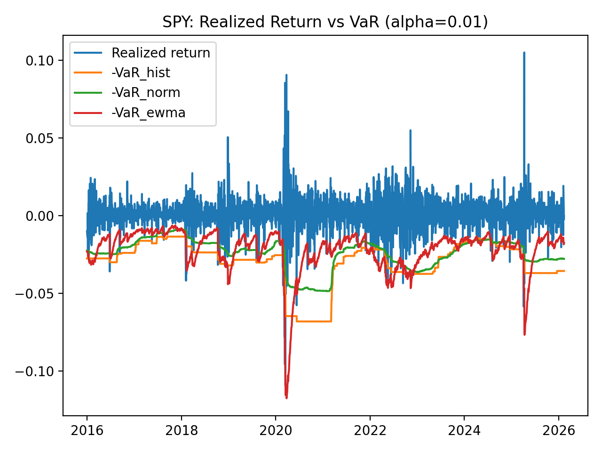
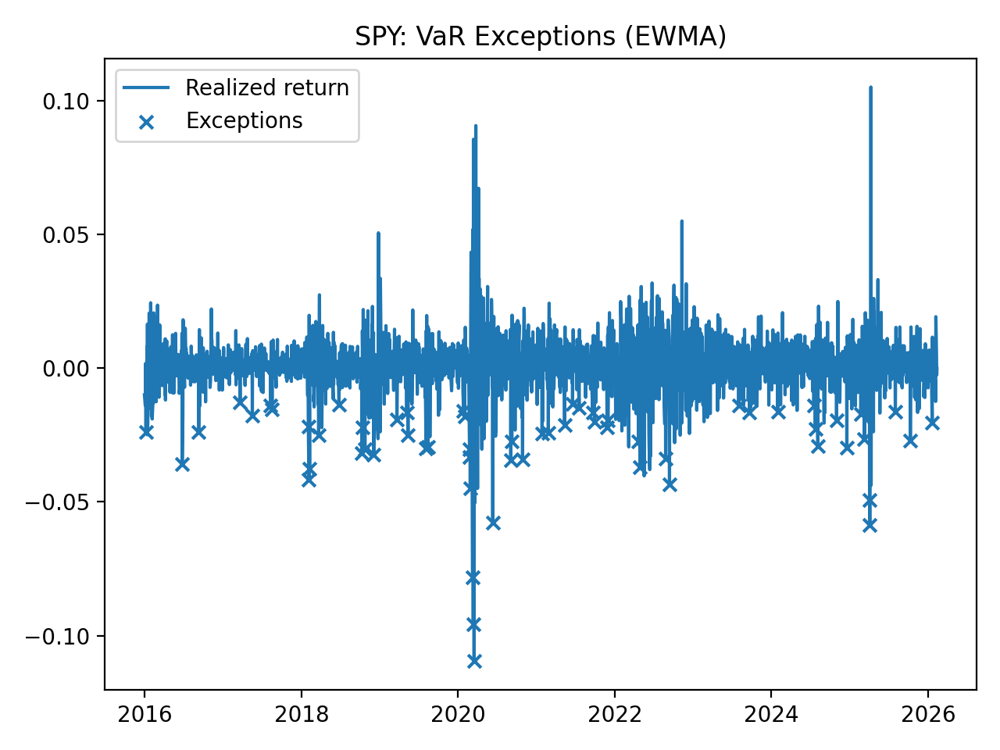

# Project 01 — VaR / ES Engine + Backtesting (Python)
This project is motivated by my experience in equity proprietary trading and focuses on practical market risk validation: VaR exceptions, coverage tests, and exception clustering.

## Objective
Compute daily VaR/ES and validate using standard backtesting (Kupiec, Christoffersen).

## Models
- Historical VaR/ES
- Parametric (Normal) VaR/ES
- EWMA volatility VaR/ES

## Validation
- VaR exceptions
- Kupiec POF
- Christoffersen independence

## How to run

```bash
pip install -r requirements.txt
```

## Results (sample)

### Realized return vs VaR (99%)


### VaR exceptions (EWMA)


**Config:** Ticker = SPY, alpha = 1%, rolling window = 250 trading days.
## Key takeaways
- EWMA VaR adapts faster to volatility regime changes than rolling historical/normal VaR.
- Exception clustering tends to appear during market stress periods, motivating independence testing (Christoffersen).
- Parametric (Normal) VaR can underestimate tail risk under heavy tails, while ES is more sensitive to tail losses.

Backtest summary: [`outputs/backtest_summary.csv`](outputs/backtest_summary.csv)
